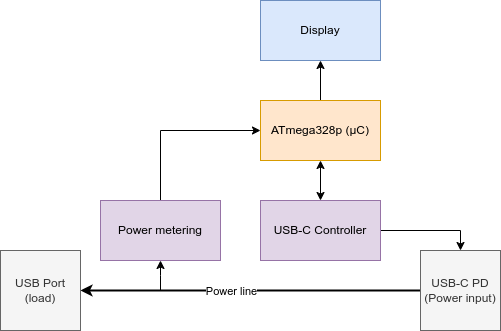

## Introduction
Small USB power metering to monitor charging cycle of small electronics objects. Mostly made for my bicycle light.

## BOM
- Power regulator: 
- Power metering: INA219 by Texas Instrument (cheap), 0.63$
- µC: ATmega328p by Microchip (chosen due to ease of programming with an arduino board around), 3.16$
- Display: Controlled by I2C
- USB Controller (for USB-C PD): HUSB238 by Hynetek (cheap, small & adapted to current project), 0.57$

## Power metering
We will use the INA219 to measure the power consumption of the load and the board.   
  
AO, A1: set adress of device for I2C. Default (both connected to ground) is 0x40.  
SDA, SCL: I2C  
Vs: 5V  

  
Controllable with I2C.  
Rshunt: 0.01 ohms  
RF1, RF2, CF: Use for filter (not required), 10R, 10R, 0.1µF  

Pin A0 and A1 will not be configurable.  

## USB-C Controller
A HUSB238 is used as en USB-C Controller.
  

### Footprints creation
The HUSB238 footprints is not included and Kicad and any symbols libraries.  It need to be made manually.  

## References
[HUSB238](https://www.hynetek.com/uploadfiles/site/219/news/aabbbbdb-48c9-4a44-a6dc-2c15f53282e6.pdf)  
[INA219](https://www.ti.com/lit/ds/symlink/ina219.pdf)  
